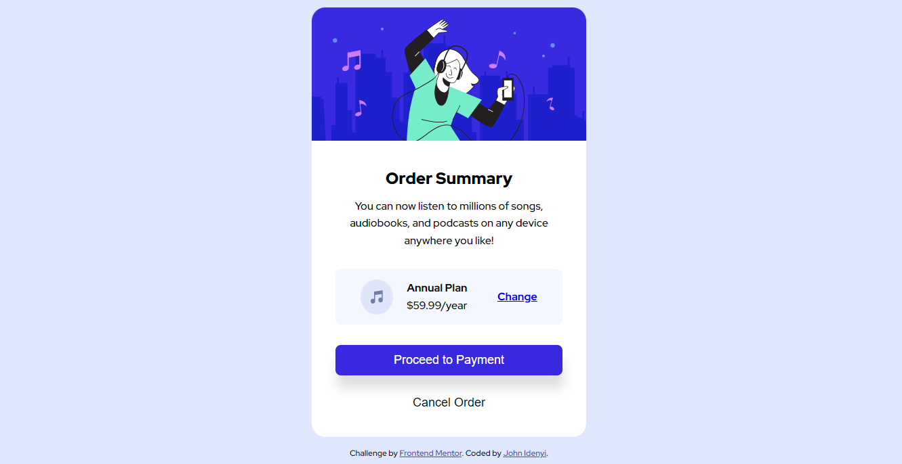

# Frontend Mentor - Order summary card solution

This is a solution to the [Order summary card challenge on Frontend Mentor](https://www.frontendmentor.io/challenges/order-summary-component-QlPmajDUj). Frontend Mentor challenges help you improve your coding skills by building realistic projects. 

## Table of contents

- [Overview](#overview)
  - [The challenge](#the-challenge)
  - [Screenshot](#screenshot)
  - [Links](#links)
- [My process](#my-process)
  - [Built with](#built-with)
  - [What I learned](#what-i-learned)
  - [Continued development](#continued-development)
  - [Useful resources](#useful-resources)
- [Author](#author)
- [Acknowledgments](#acknowledgments)

## Overview
This is my first challenge since I joined Frontend Mentor. I started with this Order-summary-component because it looks easy and will help me understand how to build things before moving to advanced projects.

### The challenge

I added a css property of cursor: pointer; in order to create hover states for buttons and links.

### Screenshot



### Links

- Solution URL: [Add solution URL here](https://github.com/JohnIdenyi/order-summary-component/)
- Live Site URL: [Add live site URL here](https://order-summary-component-project.netlify.app/)

## My process
  I started with the HTML markup before applying CSS rules. Writing your HTML first helps place my contents on the webpage without missing any and then focus on the styling.
### Built with

- Semantic HTML5 markup
- CSS custom properties
- Flexbox

### What I learned

I learned about viewport and also used my understanding of flexbox to align elements properly in the container. I also learned about box-shadow which I used for "Proceed to Payment" button.

```html
<div class="grid">
          <div class="plan">
            
            <div class="price">
              <p>Annual Plan</p>
              <p>$59.99/year</p>
            </div>
          </div>
          <div class="change-link">
            <a href="#">Change</a>
          </div>
        </div>
```
```css
.description .grid {
    background-color: hsl(225, 100%, 98%);
    display: flex;
    justify-content: space-around;
    align-items: center;
    margin-top: 30px;
    padding: 15px;
    border-radius: 8px;
} 
```

### Continued development

I still want to improve my CSS skills. I'd love to master grid, flexbox and also be comfortable with viewport, height and width.

### Useful resources

- [Example resource 1](https://www.freecodecamp.org/) - This helped me understand CSS properties like flexbox,positioning and so much more. I really liked this pattern and will use it going forward.
- [Example resource 2](https://www.youtube.com/c/TraversyMedia) - This is an amazing youtube resource for web development which helped me finally understand how to use some of the HTML markups and CSS advanced properties. I'd recommend it to anyone still learning flexbox, grid and positioning.

## Author

- Website - [John Idenyi](https://www.your-site.com)
- Frontend Mentor - [@JohnIdenyi](https://www.frontendmentor.io/profile/JohnIdenyi)
- Twitter - [@Blazecodyy]https://twitter.com/Blazecodyy)

## Acknowledgments

I'll like to appreciate freecodecamp for the well structured curriculum which really made me confident in web development. I also want to acknowledge Brad Traversy who is a youtuber for his wonderful tutorials which helped me while learning.